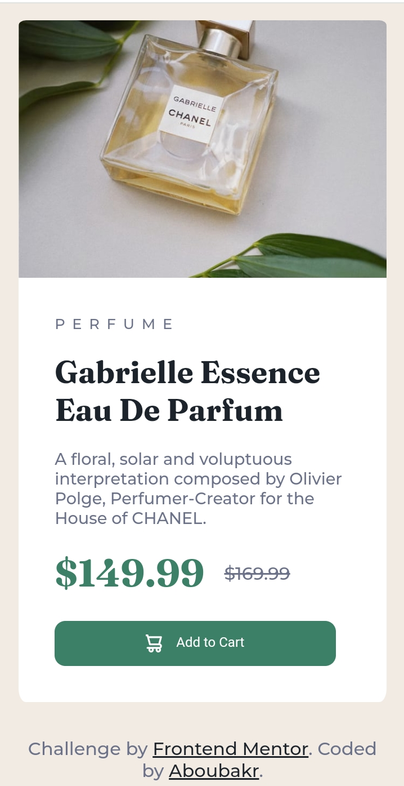
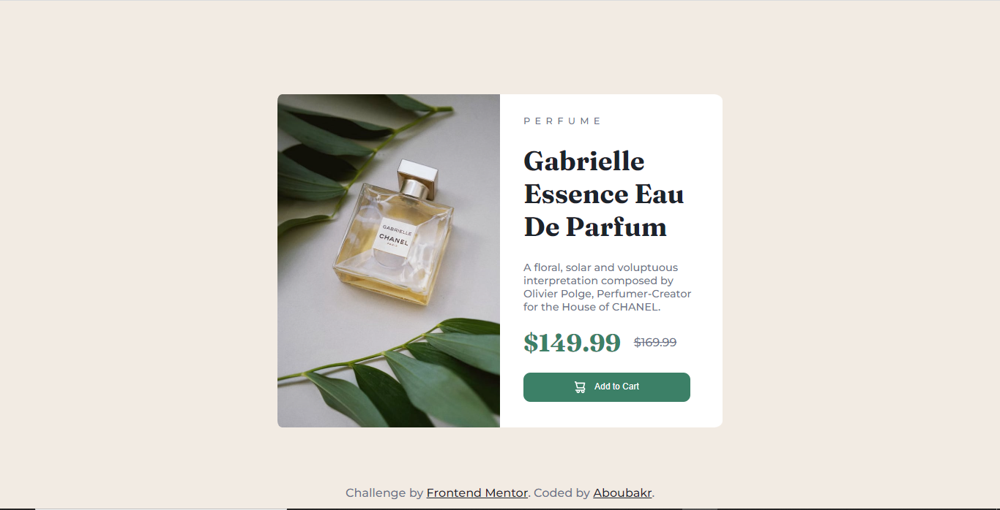

# Frontend Mentor - Product preview card component solution

This is a solution to the [Product preview card component challenge on Frontend Mentor](https://www.frontendmentor.io/challenges/product-preview-card-component-GO7UmttRfa). Frontend Mentor challenges help you improve your coding skills by building realistic projects. 

## Table of contents

- [Overview](#overview)
  - [The challenge](#the-challenge)
  - [Screenshot](#screenshot)
  - [Links](#links)
- [My process](#my-process)
  - [Built with](#built-with)
  - [What I learned](#what-i-learned)
  - [Continued development](#continued-development)
- [Author](#author)
- [Acknowledgments](#acknowledgments)


## Overview

### The challenge

Users should be able to:

- View the optimal layout depending on their device's screen size
- See hover and focus states for interactive elements

### Screenshot

-Mobile version-



 -Desktop version




### Links

- Solution URL:  (https://github.com/Aboubakr06/product-preview-card-component-main#links)
- Live Site URL: (https://gentle-dolphin-f871ca.netlify.app/)

## My process

### Built with

- Semantic HTML5 markup
- CSS custom properties
- Flexbox
- CSS Grid
- Mobile-first workflow


### What I learned

```css

#price-1 {
    text-decoration: line-through;
}

svg {
    display: inline-block;
    vertical-align: middle;
}

@media screen and (max-width: 375px){

    .img{
        content: url("images/image-product-mobile.jpg");
    }
    
}
```
### Continued development

I want to learn more about responsive design because i'm still not good at it, so i can move to learn other things. 

## Author

- Frontend Mentor - [@Aboubakr06](https://www.frontendmentor.io/profile/Aboubakr06)
- Twitter - [@elbouzidi99](https://twitter.com/elbouzidi99)


## Acknowledgments

Thanks to https://scrimba.com for the free courses they offer on CSS and JavaScript. 
